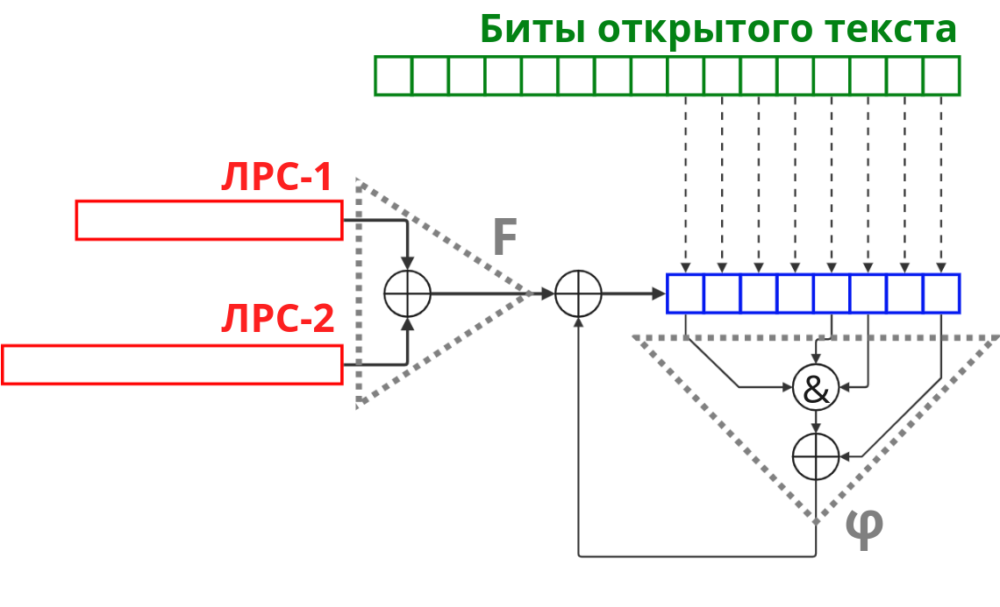

# Шифр Колонной Замены



В данной схеме шифрования используется 2 ключа длины 24 и 32 бита. Они являются начальным заполнением ЛРС-1 и ЛРС-2 соответственно. Каждый байт открытого текста помещается в неавтономный регистр сдвига, после чего совершается 10 тактов. 

В каждом такте вычисляется:
1. значение функции обратной связи $\phi$ и складывается с очередным битом ключевого потока, который получается на выходе функции F.
2. Результат помещается со сдвигом в неавтономный регистр.

Полученная после 10 таких тактов байт в регистре является байтом шифртекста. Шифрование продолжается (ЛРС при этом не сбрасываются), пока в открытом тексте не кончатся буквы.

В данной работе предлагается вскрыть шифр по паре открытого и шифр текста, используя криптографическую «слабость» схемы: малая длина управляющей комбинации. 

Рассматривая пару батов открытого и шифртекста, требуется найти все подстановки, переводящие байты открытого текста в байт шифртекста. Каждая из подстановок определяется 10 битами ключевого потока. Получая на каждую пару букв открытого и шифртекста список возможных отрезков ключевого потока, нужно перебрать варианты гаммы используя критерий на открытый текст.

## 1. Реализуем шифр

Реализуем все необходимые компоненты ширфа, в соответствии со схемой шифрования

### 1.1. Компоненты управляющего блока

В первую очередь определим функцию $\phi(x_7,...x_0)=x_0\oplus x_2x_3x_7$.
При этом считаем, что $x=x_7...x_0$ - битовое представление очередного байта, а результрующий бит функции храним в младшем бите выходного байта


```python
def phi(x):
    return ( 
        (x) ^ ((x>>2)&(x>>3)&(x>>7)) 
    ) & 1
```

Далее определим функцию одного такта $g$ которая зависит от байта состояния $x=(x_7,....,x_0)$ и бита ключевого потока $\gamma_i$

Причем $g_{\gamma_i}(x) = (\gamma_i \oplus \phi(x), x_7,...,x_1)=(\gamma_i \oplus x_0 \oplus x_2x_3x_7, x_7, ...,x_1)$


```python
def g(gamma, x):
    
    return (
        ((x>>1) &0x7F) 
        ^ 
        ((phi(x) ^ (gamma &1)) << 7)
    )
```

Обратное преобразование для $g$ можно вычислить как сдивг влево:

$g^{-1}_{\gamma_i}(y) = (y_6,...,y_0,\phi(y_6,...,y_0,y_7)\oplus\gamma_i)$

Действительно, 

$g_{\gamma_i}(g_{\gamma_i}^{-1}(y)) =g_{\gamma_i}(y_6,...,y_0,\phi(y_6,...,y_0,y_7)\oplus\gamma_i)=$

$=(\gamma_i \oplus \phi(y_6,...,y_0,\phi(y_6,...,y_0,y_7) \oplus \gamma_i,y_6,...y_0)=$

$=(y_6y_2y_1 \oplus \phi(y_6,...,y_0,y_7),y_6,...,y_0)=$

$=(y_6y_2y_1 \oplus y_6y_2y_1 \oplus y_7,y_6,...,y_0)=(y_7,y_6,...,y_0)=y$


```python
def inv_g(gamma, y):
    return (
        ((y<<1) &0xFE)
        ^ 
        phi(
            ((y<<1) &0xFF)
            ^ 
            ((y>>7) &1)
        )
        ^
        (gamma &1)
    )
```

### 1.2. Генератор ключевого потока

Теперь необходимо определить регистры, реализуемые шифром в генераторе ключевого потока

Для этого создадим класс, который будет принимать длину состояния в битах, функцию обратной связи и начальное состояние


```python
class R:
    def __init__(self, stateLen, feedBack, initState):
        self.s = initState
        self.l = stateLen
        self.f = feedBack
    
    # извлечение младшего бита состояния
    # с последующм сдивгом вправо и изменением старшего бита
    # в соответствии с функцией обратной связи
    def pop(self):    
        #self.debug()
        state = self.s
        self.s = (
            # формрование старшего бита
            ((self.f(state) & 1) << (self.l-1))  
            ^
            # сдвиг вправо
            ((state >> 1) & ((1 << (self.l-1))-1)) 
        )
        # младший бит
        return state & 1 
    
    def debug(self):
        print(f"\tR[{self.l}]: {bin(self.s)[2:].rjust(self.l, '0')}")
```

Зададим регистры битами, которые формируют обратную связь:


```python
F1=0x1155105
F2=0x101000001
```

Такое представление эквивалентно представлению многочленами:


```python
from sympy import Poly, gcd, symbols, parse_expr
```


```python
x = symbols('x')
```


```python
F1x = Poly(map(int, list(bin( F1 )[2:])), x, modulus=2)
F2x = Poly(map(int, list(bin( F2 )[2:])), x, modulus=2)
```


```python
F1x
```


$\displaystyle \operatorname{Poly}{\left( x^{24} + x^{20} + x^{18} + x^{16} + x^{14} + x^{12} + x^{8} + x^{2} + 1, x, domain=\mathbb{F}_{2} \right)}$


```python
F2x
```


$\displaystyle \operatorname{Poly}{\left( x^{32} + x^{24} + 1, x, domain=\mathbb{F}_{2} \right)}$


### 1.3. Функции шифрования и расшифрования

В соответствии со схемой, зашифрование каждого байта $x\in X$ реализуется:
1. вычисление 10 знаков гаммы $\gamma_1,...,\gamma_{10}$ как $R1 \oplus R2$
2. 10 тактами функции $g$ на соответствующих знаках гаммы, следующих в прямом порядке - $\gamma_1,...,\gamma_{10}$

Определим соответствующие функции обратной связи регистров


```python
def f1(s):
    return bin(s & F1 & 0xFFFFFF).count('1') % 2

def f2(s):
    return bin(s & F2 & 0xFFFFFFFF).count('1') % 2
```


```python
def encryption(X, key1, key2):
    R24 = R(stateLen=24, feedBack=f1, initState=key1)
    R32 = R(stateLen=32, feedBack=f2, initState=key2)
    Y = b''
    for x in X: 
        y = x
        gammas = [R24.pop() ^ R32.pop() for _ in range(10)]
        for gamma in gammas:
            y = g(gamma, y)
        Y += bytes([y])
    return Y
```

Расшифрование каждого байта $y\in Y$ реализуется:
1. вычисление 10 знаков гаммы $\gamma_1,...,\gamma_{10}$ как $R1 \oplus R2$
2. 10 тактами функции $g^{-1}$ на соответствующих знаках гаммы, следующих в обратном порядке - $\gamma_{10},...,\gamma_1$


```python
def decipher(Y, key1, key2):
    R24 = R(stateLen=24, feedBack=f1, initState=key1)
    R32 = R(stateLen=32, feedBack=f2, initState=key2)
    X = b''
    for y in Y:
        x = y
        gammas = [R24.pop() ^ R32.pop() for _ in range(10)]
        for gamma in gammas[::-1]: # обратный порядок гамм
            x = inv_g(gamma, x)
        X += bytes([x])
    return X
```


### 1.4. Примеры шифрования сообщения

Попробуем зашифровать сообщение: "Криптографические методы защиты информации"

В первую очередь, сгенерируем ключи:


```python
import random

k1 = random.randint(0, 1 << 24)
k2 = random.randint(0, 1 << 32)

print(f"k1: {bin(k1)[2:]}")
print(f"k2: {bin(k2)[2:]}")
```

    k1: 101000000111011011111011
    k2: 111100001001011101110011000011

```python
message = "Криптографические методы защиты информации"
bMessage = bytes(message, encoding="utf-8")
```

Вычислим результат зашифрования:


```python
cip = encryption(bMessage, k1, k2)
print(cip)
```

    b'\xbe|\x96\x0e\x9cy\x9aN\xce\x0cp \xbe>\x96\x0e\x9c;\xda@\x16\x820\xa6\xbe\xae\x96\xc6\x9c\xd8\x9a\xce\x16\xc1L?`\xea\x83\xd6\x08\xc6\xcdu\n\xd8\xbe\xc7\xbe\xff^\x03\xd4\x0c\x9a\xce\xce\x0c0\xa5\x86\xea\xc0\x1e\x86\x1e\x8buX\xd8d?`\xea\xc2\xd6\t\xc6\x84u\t'


Расшифруем сообщение:


```python
p = decipher(cip, k1, k2)
print(p.decode('utf-8'))
```

    Криптографические методы защиты информации


## 2. Пробуем выскрыть шифр 

Будем рассматривать каждую пару байтов открытого и шифртекста.


### 2.1. Сообщение для анализа

Пусть имеются пары о.т./ш.т. текстов, использованных на одном ключе. Сгенерируем ключи и сформируем такие пары:


```python
k1 = random.randint(0, 1 << 24)
k2 = random.randint(0, 1 << 32)

print(f"k1: {hex(k1)[2:]}")
print(f"k2: {hex(k2)[2:]}")
```

    k1: 6465a
    k2: 0x79826546

```python
bMessage = b'Meet me on Monday at 5pm'
```


```python
cip = encryption(bMessage, k1, k2)
print(cip)
```

    b'\x94\x19}\xb3HPwxL\xd2\xc2~\x0c\xbb=w\x8d\x03\xb4l\x8f\x04Vv'


### 2.2. Нахождение эквивалентного регистра

Для удобства анализа, мы представим два регистра одним.
Для этого вычислим НОК их многочленов:


```python
LCMx = ( (F1x * F2x) // gcd(F1x, F2x) ).as_poly()
LCMx
```


$\displaystyle \operatorname{Poly}{\left( x^{40} + x^{34} + x^{26} + x^{24} + x^{8} + x^{2} + 1, x, domain=\mathbb{F}_{2} \right)}$

И в соответствующих бинарной и шеснадцатиричной записях: 


```python
LCM = int(''.join(map(str, LCMx.as_list())), base=2)
print(f"hex: {hex(LCM)[2:]}")
print(f"bin: {bin(LCM)[2:]}")
```

    hex: 10405000105
    bin: 10000010000000101000000000000000100000101


Заметим, что поскольку на каждом символе открытого текста происходит 10 тактов, для хватит $k$ пар о.т./ш.т., где $10k\ge deg(НОК(F_1, F_2))$

В нашем случае, хватит 4-ех пар


```python
k = 4
```


### 2.3. Вычисление всевозможных подстановок управляющей комбинации  

Найдем для каждой из 4-х пар подстановки, которые переводят символ открытого текста в соответствующие символ шифрованного текста

Заметим, что, подстановок, реализуемых 10 тактами - ровно $2^{10}=1024$, каждая из которых определяется битом ключевого потока.
Причем каждая подстановка определяется последовательностью из $2^8$ бит

Трудозатраты на вычисление всех подстановок небольшие. Вычислим их:


```python
# gammas - 10 битное число
# i-ый бит соотвествует знаку i-ому знаку гаммы
# gammas = 1111000011 соответствует подстановке G:
# G = g[1]g[1]g[0]g[0]g[1]g[1]...g[1],
# где g[k] = функция одного такта со знаком гаммы k 
S = {
    gammas: [   
        g( (gammas>>9) &1,
        g( (gammas>>8) &1,
        g( (gammas>>7) &1,
        g( (gammas>>6) &1,
        g( (gammas>>5) &1,
        g( (gammas>>4) &1,
        g( (gammas>>3) &1,
        g( (gammas>>2) &1,
        g( (gammas>>1) &1,
        g( (gammas>>0) &1, x )))))))))) 
        for x in range(1<<8)
    ] 
    for gammas in range(1<<10)
}
```

Кажое $B_i$ состоит из значений отрезка гаммы ($10$ знаков), которые может порождать ключевой поток на $i$-ой букве


```python
possibleGammas = {}

for i in range(k):
    possibleGammas[i] = []
    for gammas, G in S.items():
        if G[ bMessage[ i ] ] == cip[ i ]:
            possibleGammas[i].append(gammas)  

print(possibleGammas)
```

    {0: [31, 286, 541, 796], 1: [9, 264, 651, 970], 2: [152, 409, 602, 795], 3: [55, 310, 689, 944]}


Проинтерпритируем полученый результат. Первый байт открытого текста может перейти в соответствующий байт шифртекста 4-мя вариантами в зависимости от ключевого потока.


### 2.4. Определяем эквивалентные функции шифрования и расшифрования

Определим функцю обратной связи эквивалентного регистр сдивга, а также эквивалентные функции ширования и расшифрования через регистр $R_{40}$. Используем для этого найденный НОК многочленов в пункте 2.2


```python
def lcmF(s):
    return bin(s & LCM & 0xFFFFFFFFFF).count('1') % 2
```


```python
def eq_encryption(Y, key):
    R40 = R(stateLen=40, feedBack=lcmF, initState=key)
    X = b''
    for y in Y:
        x = y
        gammas = [R40.pop() for _ in range(10)]
        for gamma in gammas:
            x = g(gamma, x)
        X += bytes([x])
    return X
```


```python
def eq_decipher(Y, key):
    R40 = R(stateLen=40, feedBack=lcmF, initState=key)
    X = b''
    for y in Y:
        x = y
        gammas = [R40.pop() for _ in range(10)]
        for gamma in gammas[::-1]:
            x = inv_g(gamma, x)
        X += bytes([x])
    return X
```

Проверим, что функции корректны. Для этого попробуем зашифровать и расшифровать сообщение:


```python
key = random.randint(0, 1<<40)
eq_decipher(eq_encryption(b'Secure message!', key), key)
```


    b'Secure message!'

Если посмотрим на первые 40 знаков гаммы, которые порождаются регистрами $R_{24}$ и $R_{32}$, а также на знаки гаммы регистра $R_{40}$, то заметим, что они действительно эквивалентны:


```python
R24 = R(stateLen=24, feedBack=f1, initState=k1)
R32 = R(stateLen=32, feedBack=f2, initState=k2)
R24_R32_gammas_40 = ''.join(map(str, [R24.pop() ^ R32.pop() for _ in range(40)]))[::-1]

R40 = R(stateLen=40, feedBack=lcmF, initState=int(R24_R32_gammas_40, base=2))
R40_gammas_40 = ''.join(map(str, [R40.pop() for _ in range(40)]))[::-1]

print(f'R24^R32: {R24_R32_gammas_40}')
print(f'    R40: {R40_gammas_40}')
```

    R24^R32: 0100110110001001100001000010001100011100
        R40: 0100110110001001100001000010001100011100


Здесь первый знак гаммы соответствует правому (младшему) биту - также, как они лежат в регистре на схеме

И вообще, любой отрезок:


```python
Len = 100000

R24 = R(stateLen=24, feedBack=f1, initState=k1)
R32 = R(stateLen=32, feedBack=f2, initState=k2)


R24_R32_gammas = ''.join(map(str, [R24.pop() ^ R32.pop() for _ in range(Len)]))[::-1]

R40 = R(stateLen=40, feedBack=lcmF, initState=int(R24_R32_gammas_40, base=2))

R40_gammas = ''.join(map(str, [R40.pop() for _ in range(Len)]))[::-1]

print(R24_R32_gammas == R40_gammas)
```

    True


### 2.5. Восстановление отрезка гаммы


```python
possibleGammas
```


    {0: [31, 286, 541, 796],
     1: [9, 264, 651, 970],
     2: [152, 409, 602, 795],
     3: [55, 310, 689, 944]}

Поскольку эквивалентный регистр сдвига длиной $40$ бит, то один из $4^4$ вариантов ключевого потока является начальным заполнением регистра. Вариантов не много, а значит можно просто перебрать.


```python
i = 1
for gamma_4 in possibleGammas[3]:
    for gamma_3 in possibleGammas[2]:
        for gamma_2 in possibleGammas[1]:
            for gamma_1 in possibleGammas[0]:
                key = int(
                      bin( gamma_4 )[2:].rjust(10, '0')
                    + bin( gamma_3 )[2:].rjust(10, '0')
                    + bin( gamma_2 )[2:].rjust(10, '0')
                    + bin( gamma_1 )[2:].rjust(10, '0'),
                    base=2
                )
                try:
                    print("{:3d}. eq_decipher( cip, '{}' ) = '{}'". format(
                        i,
                        hex(key)[2:],
                        eq_decipher(cip, key).decode('utf-8') # критерий на корректные символы юникода
                    ))
                    i+=1
                except:
                    continue
```

      1. eq_decipher( cip, 'dc980261d' ) = 'Meet%h-!jk`/&da6%!u%00,'
      2. eq_decipher( cip, 'dc980271c' ) = 'Meetde5+x ^o&da70aal%p~'
      3. eq_decipher( cip, 'dc984221d' ) = 'Meet!h-5nk`/nda2%!a!00<'
      4. eq_decipher( cip, 'dc984231c' ) = 'Meet`e!/z Londa30auh%pl'
      5. eq_decipher( cip, 'dd990261d' ) = 'Meet0}ap;z$Y/&dao0e$0%ty'
      6. eq_decipher( cip, 'dd990271c' ) = 'Meetqh)dzkd	o&dan%%0{04)'
      7. eq_decipher( cip, 'dd994221d' ) = 'Meet4}ad?x$I/ndak0e04%ti'
      8. eq_decipher( cip, 'dd994231c' ) = 'Meetuh)p~kdondaj%%$04;'
      9. eq_decipher( cip, '4d8980261d' ) = 'Meetex- *`\r/&da~5!tm 0-'
     10. eq_decipher( cip, '4d8980271c' ) = 'Meet$me4kn ]o&da} a`$5p}'
     11. eq_decipher( cip, '4d8984221d' ) = 'Meetax-4.}`/ndaz5!`i 0?'
     12. eq_decipher( cip, '4d8984231c' ) = 'Meet me on Monday at 5pm'
     13. eq_decipher( cip, '4d9990261d' ) = 'Meetpmaq{n$Z/&da' e%z5tz'
     14. eq_decipher( cip, '4d9990271c' ) = 'Meet1z)e:}o&da&5%11 4('
     15. eq_decipher( cip, '4d9994221d' ) = 'Meettmaen$H/nda# e1~5th'
     16. eq_decipher( cip, '4d9994231c' ) = 'Meet5z)q>donda"5%%5 48'


**Таким образом мы сократили перебор ключа с $2^{40}$ до $2^8$ !**
